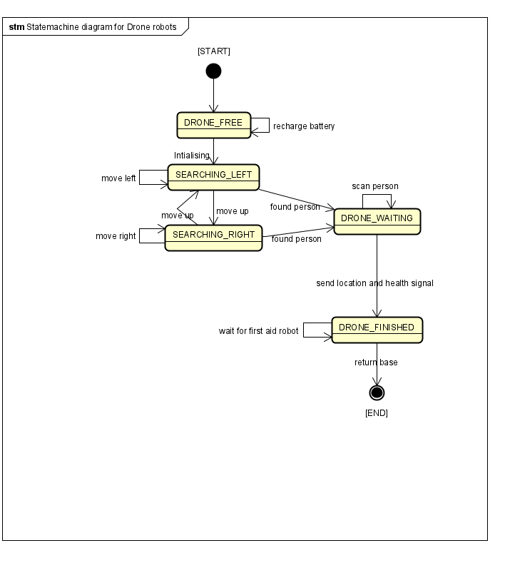
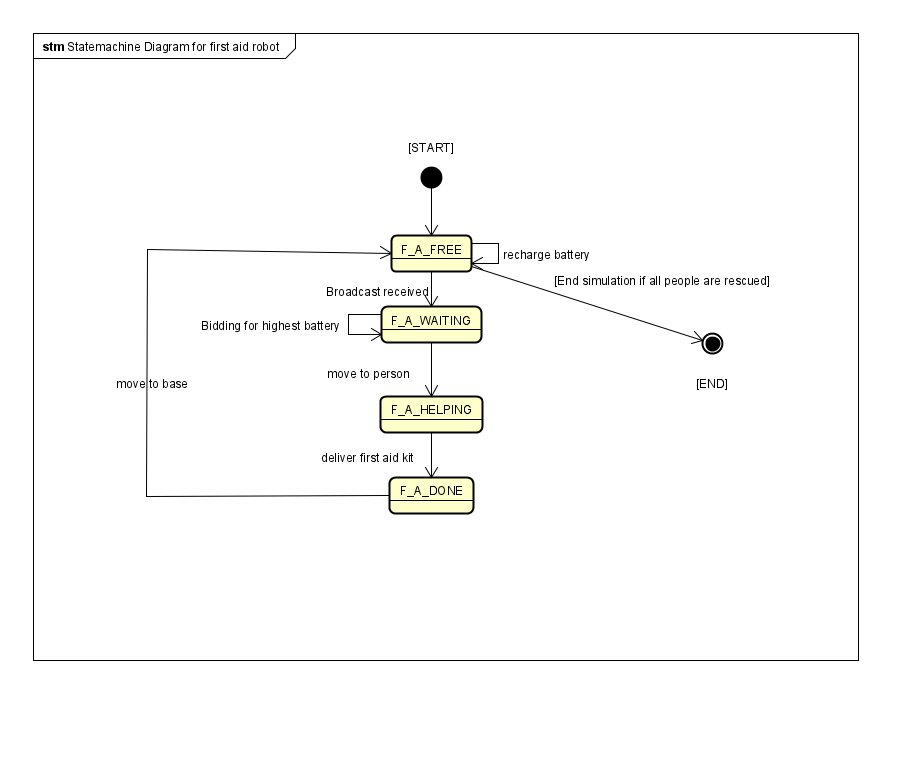

# Drone and first aid terrain robot simulation
### Extended operation has been implemented in the above simulation starting of with:

- To portray agents in this simulation, icons have been used to help better simulate them that were found online, the web links of those icons have been included as a comments in Portrayal file.

### **At the start of the simulation:**
- Location, age and health of each person is randomly simulated whiten contsraints as the person unlikely to be too old or too young or unhealthy to be climbing the mountain.

- 3 robots (3 drones, 3 First Aid) are simulated outside the mountain, that have battery random battery generated for them.

- The mountain has 3 different levels diffrentiated by colours

- Person location is generated randomly within each level of the mountain.

## Simulation and searching:

* 3 Drones start the searching all together according to the state chart diagram, visiting every cell until finding the 3 missing people.

* Then once a person is found the drone scan them and generate the person health and age, and calculates the urgency by dividing health by person age. The lower the number the Higher the urgency 

* Then the drone sends a broadcast with person location to the first aid terrain robots and waits until they get rescued, where a bidding process happens that picks the robot with highest battery.

* The robot with highest battery then goes to the person and deliver first aid kit and essentials and increase the person health by 15%

* The drone waits for the first aid terrain robot to arrive then the box is delivered and both drone and first aid robot returns to their intial starting point(base).

* When all persons are rescued and both drones and terrain robots return to base the simulation ends.

## Important:

* ensure to update the location of the icon images that are inside resources, ideally open src folder in vscode

* ensure to open the folder from **src** folder to avoid problems with icons path 

## State Chart diagrams:

### State chart diagram for Explorer drone

### State chart diagram for First aid terrain robots
