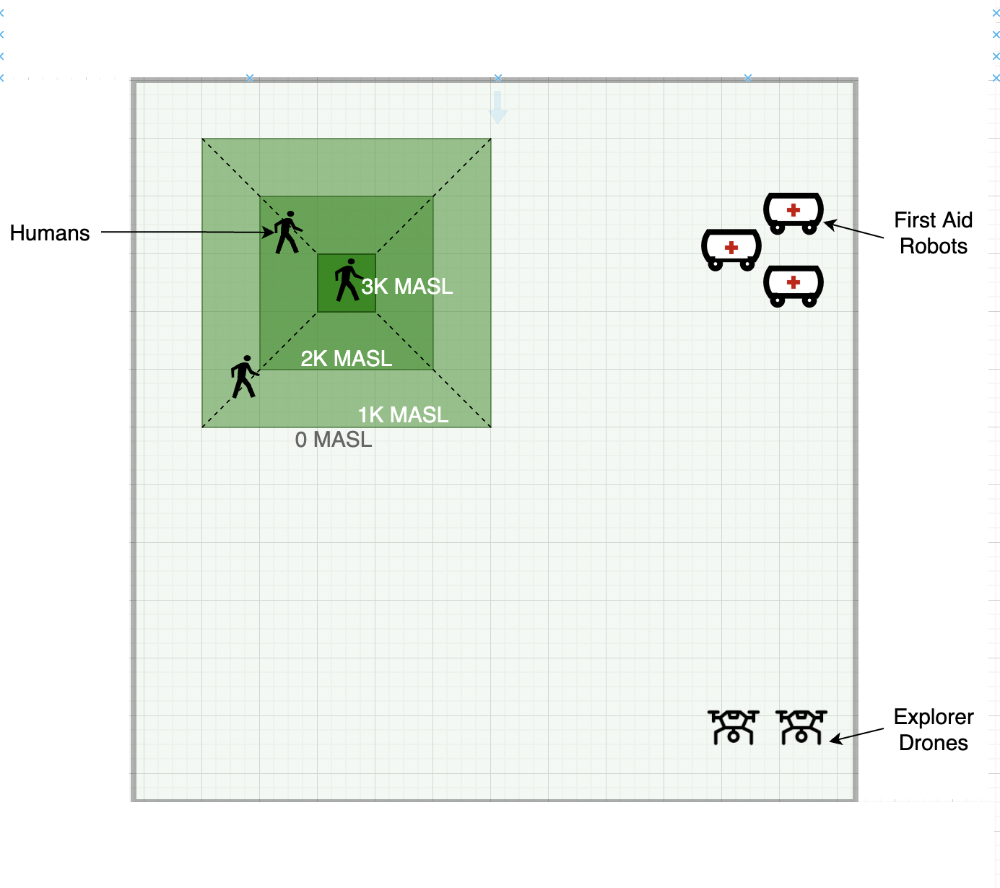

# AA-MAS Portfolio Assignment Specification

## 

| **Module Code**                  	| **Run**  	| **Module Title**                                	|
|----------------------------------	|----------	|-------------------------------------------------	|
| UFCXR-15-3                       	| 22SEP/1  	| Autonomous Agents and Multiagent Systems        	|
| **Module Leader**                	|          	| **Module Tutors**                               	|
| Marco Perez Hernandez (MPH)            	|          	| MPH & Antisthenis Tsompanas 	|
| **Component and Element Number** 	|          	| **Weighting (% of the Module's assessment)**    	|
| B: CW1                           	|          	| 50%                                             	|
| **Element Description**          	|          	| **Total Assignment Time**                       	|
| Portfolio Assignment             	|          	| 30 hours + 4 hours in-class time                	|

## Submission Details

| **Date Issued to Students**     	| **Submission Date** 	|
|---------------------------------	|---------------------	|
| 08/Nov/2022                     	| 13/Dec/2022         	|
| **Submission Channel**          	| **Submission Time** 	|
| Electronic via GitHub Classroom 	| 2:00 pm             	|
| **To be returned to Students**  	|                     	|
| 20/Jan/2023                     	|                     	|

## Deliverables

This assessed work must be submitted by committing and pushing the solution to your own individual GitHub repository that is created once you accept the assignment. You will create a file called `solution.md` in the root of your repository and have a link for each task of your solution. Python code should be organised within the `src` folder.

**Note**: Make sure your GitHub username is linked to your student username and ID.

## e-Signed By:

Marco Perez Hernandez (ML)

## Overview

### **Mountain Rescue Robots**

In the last few years, robots have been used in mountain rescue missions due to their capacity to reach remote locations without risking human teams. A recent example from the [Scottish Mountain Rescue](https://www.bbc.com/news/articles/czqd74e34w9o) shows how Small Unmaned Aircraft (SUA) are used for these critical missions.

For this coursework, assume the hardware for two types of next generation robots has been built with the following characteristics:

**First-Aid Terrain Robots**

These are basic robots that have capacity to carry first-aid kits including water, blankets and painkillers among others. These robots are able to move and climb mountains to deliver these first-aid kits, while people can be rescued. The speed of these robots gets limited when they are climbing. 

**Explorer Drones**

These aircrafts are similar to the SUA used by Scottish Mountain Rescue, however the main difference is that these are drones that are able to explore autonomously and send signals to other robots (e.g. to first-aid terrain robots) about the location of the persons to be rescued . These robots move in 6 directions: front, back, left, right, up and down. Once they locate a person, these drones are able to take pictures that enables them to use computer vision algorithms to calculate the urgency to assist a person, given their estimated current age and health.

Tasks 1,2 and 3 are related to the Mountain Rescue Robots.

## **TASKS**

### Task 1:  Agent Design (20% assignment marks)

For this task you need to create the **statechart** diagrams of the autonomous agents for the next generation rescue robots. You should design 2 types of robots: First-aid Terrain Robots and Explorer Drones. You should identify actions, states and transitions that consider the available hardware features.

### Task 2: Agent Architecture Implementation & Simulation (45% assignment marks)

You are required to use the [mesa framework](https://mesa.readthedocs.io/en/latest/) to implement a basic simulated scenario where the First-aid Terrain Robots and Explorer Drones work for locating and providing first-aid kits to three persons that are missing in the "Green" mountain according to the image below.  

The robots should trigger actions according to the **statechart** diagrams created in Task 1. The person are located randomly along the "Green" mountain and their health is also randomly simulated.

The **basic operation** of robots include:

* Exploring and movement towards the mountain and the missing persons
* Drones locate the persons to be rescued and wait for the first-aid terrain robots, once they get there, they all return to their base stations.
* First-aid terrain robots move randomly to locate the persons and deliver the first-aid kit.

The **extended operation** of robots include:

* Communication of drone and terrain robots to provide first-aid. Drone can send messages to individual robots or broadcast location of a person, once found. 
* Robots have a battery whose energy is consumed as the simulation progresses.
* Team cooperation among terrain robots. For example, by enabling choosing the terrain robot that will serve a particular person, based on the available robot battery and the urgency for serving the persons. 

At the start of the simulation:

* Location, age and health of each person can be simulated randomly. 
* Robots and drones should be grouped separately away from the "Green" mountain.
* The "Green" mountain has three different heights: 1K,2K and 3K Meters Above Sea Level (MASL).

In case of any information not given in the description of the scenario, you are required to assume the easiest approach possible. Python code required should be placed in the `src` folder and referenced in the `solution.md` document.

### Task 3: Multiagent System Analysis (15% assignment marks)

Create a Jupyter notebook for analysis of the performance of the robots. This should include at least two relevant performance indicators:

1. How long (time steps) did it take the robots to find the three persons
2. Propose an additional indicator that you see fit.

Create plots for each indicator and briefly provide a descriptive analysis of them.

### Task 4: Agent Learning (20% assignment marks)

You are required to explore and choose **one** of the Reinforcement Learning algorithms not covered in the module sessions and write a short report (300 words) describing in **your own words** how the algorithm works. In addition, a flow chart of the algorithm and an example would make your report stronger. Some of the algorithms available are listed [here](https://docs.ray.io/en/latest/rllib/rllib-algorithms.html), however you are encouraged to browse around and choose the one you feel more comfortable with.

## Assessment Criteria

### Task 1 (max 20%)

* (1) Key actions and states identified: 10% marks
* (2) Key transitions identified: 10% marks
* (3) Both (1) and (2) are achieved: 20% marks

### Task 2 (max 45%)

* (4) The code compiles and run with some of the basic operation achieved: (up to 30% marks)
* (5) The code compiles and run with some of the extended operation achieved: (up to 40% marks)
* (6) Code compiles and fully achieves *basic* and *extended* operation: (45% marks)

### Task 3 (max 15%)

* (7) The notebook includes plot and brief analysis for one performance indicator (up to 8% of marks)
* (8) The notebook includes plots and brief analysis for the two performance indicators (up to 15% of marks)

### Task 4 (max 20%)

* (9) A basic description is given, with a weak demonstration of the understanding of the algorithm. (up to 10% of marks)
* (10) A strong demonstration of understanding of the algorithm selected, including diagrams and examples to illustrate operation. (up to 20% of marks)

**This assignment is subject to standard UWE's personal circumstances policies as found [*here*](https://www.uwe.ac.uk/study/academic-information/personal-circumstances/late-submission-window)**
